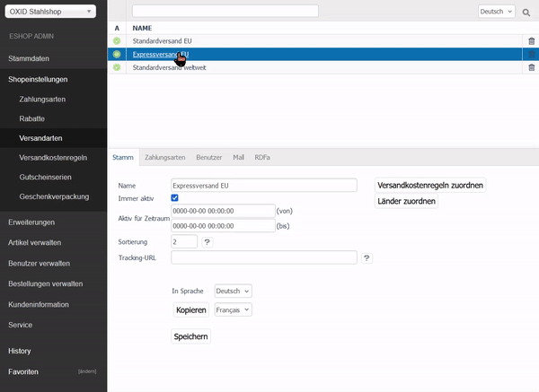

# S235 Stahl vierkant Dokumentation

## Inhaltsverzeichnis

1. [Einleitung](#einleitung)
2. [Problemstellung](#problemstellung)   
   1. [Produkte](#produkte)
   2. [Versandkostenregeln](#versandkostenregeln)
   3. [Schritte zur Umsetzung](#schritte-zur-umsetzung)
3. [Artikel erstellen](#artikel-erstellen)
   1. [Basisartikel](#basisartikel)
   2. [Varianten](#varianten)
4. [Versandarten anlegen](#versandarten-anlegen)
5. [Versandkostenregeln einrichten](#versandkostenregeln-einrichten)
   1. [Einführung in Versandkostenregeln](#einführung-in-versandkostenregeln)
   2. [Beispielregel: Expressversand (EU)](#beispielregel-expressversand-eu)
   3. [Übersicht der Versandkostenregeln](#übersicht-der-versandkostenregeln)
6. [Versandarten mit Versandkostenregeln verknüpfen](#versandarten-mit-versandkostenregeln-verknüpfen)
7. [Im Shop testen](#im-shop-testen)

## Einleitung

Willkommen! Diese Dokumentation dient als Beispiel, wie Sie verschiedene Versandkostenregeln im Adminbereich des OXID eShops einrichten können. Diese Anleitung umfasst die Erstellung der Produkte, die Einrichtung der Versandarten, die Definition der Versandkostenregeln, sowie deren  Verknüpfung mit den angelegten Versandarten. 

## Problemstellung

Die Problemstellung, die es in diesem Beispiel zu lösen gibt, ist wie folgt:

**Versandkostenregelung im OXID eShop für S235 Stahl vierkant**

Sie sind der Administrator eines OXID eShops und verkaufen S235 Stahl vierkant in verschiedenen Gewichtseinheiten. Sie möchten Versandarten und Versandkostenregeln für diese Produkte entsprechend den folgenden Vorgaben einrichten:

### Produkte:

**S235 Stahl vierkant**

In den Gewichtseinheiten:
* 100kg
* 200kg
* 500kg
* 1000kg

Wählen Sie passende Preise selbst aus.

### Versandkostenregeln:

**Standardversand innerhalb der EU:**
* Artikel < 1000kg: 200€ Versandkosten pro Artikel
* Artikel = 1000kg: 100€ Versandkosten pro Artikel
* Gesamter Warenkorb > 2000kg: Keine Versandkosten

**Expressversand innerhalb der EU:**
* Pauschal: 300€ Versandkosten pro Artikel

**Standardversand weltweit:**
* Pauschal: 400€ Versandkosten pro Artikel
* Zusätzlich 1000€ Aufschlag auf den gesamten Warenkorb

### Schritte zur Umsetzung:

**1. Erstellen der Produkte:**

Legen Sie die verschiedenen Gewichtseinheiten (100kg, 200kg, 500kg, 1000kg) des S235 Stahl vierkant im OXID eShop an.
Bestimmen Sie die Preise zu den Gewichtseinheiten selbst, so dass diese Sinn ergeben.

**2. Einrichten der Versandarten:**

Richten Sie die notwendigen Versandarten ein.

**3. Definieren der Versandkostenregeln:**

Erstellen Sie Regeln für die Berechnung der Versandkosten basierend auf dem Gewicht und der Versandart.
Stellen Sie sicher, dass Bestellungen über 1000kg innerhalb der EU versandkostenfrei sind

**4. Zusätzliche Kosten für den weltweiten Versand:**

Fügen Sie einen Aufpreis von 1000€ für alle weltweiten Sendungen hinzu. 

## Artikel erstellen

### Basisartikel

Zunächst einmal erstellen Sie den Basisartikel S235 vierkant Stahl, um von diesem im nächsten Schritt die verschiedenen Gewichtseinheiten abzuleiten. 
Gehen Sie dafür im Adminbereich zu **Artikel verwalten > Artikel** und dann unten auf die Schaltfläche **Artikel hinzufügen**. 

*Bemerkung: Falls Sie Ihren OXID eShop in mehreren Sprachen pflegen, vergessen Sie nicht, an den relevanten Stellen die Information auch zusätzlich in diesen Sprachen anzulegen.*

In diesem Fall bekommt der Artikel noch keinen Preis zugewiesen, da dieser im nächsten Schritt, der Variantenerstellung, definiert wird.

### Varianten

Klicken Sie nun auf den Reiter **Varianten** und definieren dort Ihre vier Varianten für den Artikel, nämlich **100kg, 200kg, 500kg und 1000kg**.
Geben Sie den Varianten aussagekräftige Namen, eine Artikelnummer, sinnvolle Preise, und tragen Sie die Lagerstände ein.

Danach können Sie die einzelnen Varianten individuell konfigurieren, indem Sie links unter **Edit** auf die Schaltfläche Variante editieren klicken. Hier können Sie die Attribute nochmal einzeln, unabhängig vom Vaterprodukt und den anderen Varianten, bearbeiten. In diesem Fall ist vor allem das **Gewicht** wichtig, welches Sie im Reiter **Erweitert** finden. 

## Versandarten anlegen

Als nächstes legen Sie nun die verschiedenen Versandarten an, die im Shop angeboten werden. Navigieren Sie dafür zu **Shopeinstellungen > Versandarten**. Klicken Sie nun am unteren Bildschirmbereich auf die Schaltfläche **Neue Versandart anlegen** und erstellen Sie die Versandarten.

**Wichtig:** Fügen Sie nun an den hervorgehobenen Punkten für jede Versandart zusätzlich noch Ihre akzeptierten **Zahlungsarten** hinzu, sowie die **Länder**, die Sie beliefern möchten.

## Versandkostenregeln einrichten

### Einführung in Versandkostenregeln

Nun, da die Basis für den Versand eingerichtet ist, ist es Zeit für die Versandkostenregeln. Diese berechnen die Versandkosten im Kassenvorgang basierend auf Kriterien wie Menge, Größe, Gewicht und Artikelpreis, aber auch anhand des Landes, des Nutzers, des Artikels, oder der Artikelkategorie. Je nach Einrichtung der Regeln können **mehrere Versandkostenregeln gleichzeitig** für einen Warenkorb gelten.

Im gegeben Beispiel werden Sie in erster Linie von den Kriterien **Gewicht** und **Ländern** Gebrauch machen. Ihre Versandkostenregeln berechnen die Versandkosten anhand der verschiedenen Gewichtseinheiten des Stahls und haben unterschiedliche Bedingungen für internationalen Versand, als den Versand innerhalb der EU.

Ein guter Ansatz bei Versandkostenregeln ist es, **konkrete Regeln an den Anfang** der Liste zu setzen, um dann auf generische Regeln zurückzufallen. Dies verhindert, dass Produkte von weit-umfassenden Regeln betroffen sind und zusätzlich darauf noch Versandkosten von konkreten Regeln hinzukommen.

Navigieren Sie zu **Shopeinstellungen > Versandkostenregeln** um zu beginnen. Sie werden im nächsten Schritt durch die erste Versandkostenregel geleitet und werden danach erfahren, wie man das ganze dann noch mit den Versandarten verknüpft.

### Beispielregel: Expressversand (EU)

Der Expressversand innerhalb der EU bietet Sich als erste Versandkostenregel an, die Sie erstellen können. Klicken Sie dazu auf die Schaltfläche **Neue Versandkostenregel anlegen**. Eine Möglichkeit, die Regel zu erstellen, ist folgende:

**Beachten Sie hierbei folgende Dinge:**
1. Vegeben Sie einen **aussagekräftigen Namen**. Dieser wird auf der Benutzeroberfläche für den Enduser nicht sichtbar sein und dient hauptsächlich der Klarheit und Struktur Ihrer Adminoberfläche.
2. Setzen Sie die Regel auf **Immer aktiv**, sofern Sie keinen spezifischen Zeitraum vorsehen.
3. Da das Gewicht bei dieser Pauschal-Regel keine Rolle spielt, können Sie die Bedingung auf **min. 1 Artikel** setzen.
**Wichtig:** Füllen Sie auch das zweite Feld der Bedingung aus, sonst ist die Bedingung nichtig! 
4. Der Preisaufschlag liegt bei 300€ pro Artikel. Dieser wird **absolut**, also in €, angegeben, nicht prozentual.
5. Für die Reihenfolge bietet es sich an, die Regeln mit **etwas größeren Abständen** anzulegen. Auf diese Weise können Sie bei Bedarf weitere Regeln vor und hinter dieser Regel hinzufügen. In diesem Beispiel können Sie 10 eintragen und später in Zehnerschritten mit den weiteren Regeln fortfahren.
6. Dies ist eine explizite Regel mit nur einer Bedingung. Deshalb brauchen Sie hier **keine weiteren nach dieser Regel berechnen**.
7. Da dies eine EU-spezifische Regel ist, fügen Sie über die Schaltfläche **Länder hinzufügen** alle EU-Länder hinzu, in die Sie per Express liefern möchten.

### Übersicht der Versandkostenregeln

Haben Sie nun den Rest der Regeln angelegt, sollte dies in etwa so aussehen:

Die spezifischen Versandkostenregeln wie *Express EU* und *Kostenlos EU* liegen am Anfang der Liste. Diese Regeln stehen alleine, denn sollten die Bedingungen für diese Regeln erfüllt sein, werden in beiden Fällen **keine weiteren Regeln nach dieser berechnet**.

Für den weltweiten Versand hingegen wird Ihnen vielleicht aufgefallen sein, dass dies mit *einer* Regel nicht zu bewältigen ist. Hier müssen Sie tatsächlich **zwei Regeln** anlegen. Die erste Regel berechnet dann 400€ Versand pro Artikel und wird **nicht abgebrochen**. Die zweite Regel fügt den Aufschlag von 1000€ hinzu, der vorgegeben war, und berechnet **erst dann** keine weiteren Regeln mehr.

Als letztes gibt es wieder ein Konstrukt von zwei Regeln, und zwar den Standardversand innerhalb der EU. Auf diese Berechnung wird erst zurückgefallen, wenn:
* der Versand **nicht über Express** gewählt wird,
* der Warenkorb **nicht über 2000kg** liegt, und demnach nicht kostenlos ist,
* und der Versand **nicht die EU verlässt**.

Sollten diese Regeln nicht zugreifen, bleibt also nur noch der Standard-EU Versand. Dieser berechnet 200€ Versand für jeden Artikel der **weniger als 1000kg wiegt (Teil 1)** und 100€ Versand für jeden Artikel der **genau 1000kg wiegt (Teil 2)**.

Dies deckt alle Möglichkeiten ab, die in diesem Beispiel behandelt werden sollten.

## Versandarten mit Versandkostenregeln verknüpfen

Haben Sie nun auf diese Weise alle Versandkostenregeln erstellt, müssen Sie als letzten Schritt noch einmal zu **Shopeinstellungen > Versandarten** navigieren.
Hier weisen Sie die erstellten Versandkostenregeln zu den dafür vorgesehen Versandarten zu. 

## Im Shop testen

Fertig! Nun können Sie mit **geeigneten Warenkörben** das Ganze in der Benutzeroberfläche Ihres OXID eShops einmal testen. 

Wie Sie anhand des Bildschirmfotos sehen können, liegen momentan **zwei Artikel** im Warenkorb. Der Expressversand ist  für EU-Bestellungen im Shop auswählbar und berechnet korrekterweise 300€ Versand pro Artikel, also **600€ Gesamt**.