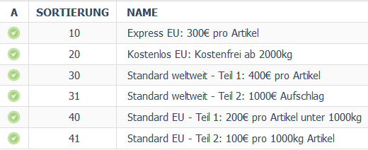

# S235 Stahl vierkant Dokumentation

## Versandkostenregeln einrichten

### Einführung in Versandkostenregeln

Nun, da die Basis für den Versand eingerichtet ist, ist es Zeit für die Versandkostenregeln. Diese berechnen die Versandkosten im Kassenvorgang basierend auf Kriterien wie Menge, Größe, Gewicht und Artikelpreis, aber auch anhand des Landes, des Nutzers, des Artikels, oder der Artikelkategorie. Je nach Einrichtung der Regeln können **mehrere Versandkostenregeln gleichzeitig** für einen Warenkorb gelten.

Im gegeben Beispiel werden Sie in erster Linie von den Kriterien **Gewicht** und **Ländern** Gebrauch machen. Ihre Versandkostenregeln berechnen die Versandkosten anhand der verschiedenen Gewichtseinheiten des Stahls und haben unterschiedliche Bedingungen für internationalen Versand, als den Versand innerhalb der EU.

Ein guter Ansatz bei Versandkostenregeln ist es, **konkrete Regeln an den Anfang** der Liste zu setzen, um dann auf generische Regeln zurückzufallen. Dies verhindert, dass Produkte von weit-umfassenden Regeln betroffen sind und zusätzlich darauf noch Versandkosten von konkreten Regeln hinzukommen.

Navigieren Sie zu **Shopeinstellungen > Versandkostenregeln** um zu beginnen. Sie werden im nächsten Schritt durch die erste Versandkostenregel geleitet und werden danach erfahren, wie man das ganze dann noch mit den Versandarten verknüpft.

### Beispielregel: Expressversand (EU)

Der Expressversand innerhalb der EU bietet sich als erste Versandkostenregel an, die Sie erstellen können. Klicken Sie dazu auf die Schaltfläche **Neue Versandkostenregel anlegen**. Eine Möglichkeit, die Regel zu erstellen, ist folgende:

**Beachten Sie hierbei folgende Dinge:**
1. Vegeben Sie einen **aussagekräftigen Namen**. Dieser wird auf der Benutzeroberfläche für den Enduser nicht sichtbar sein und dient hauptsächlich der Klarheit und Struktur Ihrer Adminoberfläche.
2. Setzen Sie die Regel auf **Immer aktiv**, sofern Sie keinen spezifischen Zeitraum vorsehen.
3. Da das Gewicht bei dieser Pauschal-Regel keine Rolle spielt, können Sie die Bedingung auf **min. 1 Artikel** setzen.
**Wichtig:** Füllen Sie auch das zweite Feld der Bedingung aus, sonst ist die Bedingung nichtig! 
4. Der Preisaufschlag liegt bei 300 € pro Artikel. Dieser wird **absolut**, also in Euro angegeben, nicht prozentual.
5. Für die Reihenfolge bietet es sich an, die Regeln mit **etwas größeren Abständen** anzulegen. Auf diese Weise können Sie bei Bedarf weitere Regeln vor und hinter dieser Regel hinzufügen.

## Übersicht der Versandkostenregeln

Haben Sie nun den Rest der Regeln angelegt, sollte dies in etwa so aussehen:

Die spezifischen Versandkostenregeln wie *Express EU* und *Kostenlos EU* liegen am Anfang der Liste. Diese Regeln stehen alleine, denn sollten die Bedingungen für diese Regeln erfüllt sein, werden in beiden Fällen **keine weiteren Regeln nach dieser berechnet**.

Für den weltweiten Versand hingegen wird Ihnen vielleicht aufgefallen sein, dass dies mit *einer* Regel nicht zu bewältigen ist. Hier müssen Sie tatsächlich **zwei Regeln** anlegen. Die erste Regel berechnet dann 400 € Versand pro Artikel und wird **nicht abgebrochen**. Die zweite Regel fügt den Aufschlag von 1000 € hinzu, der vorgegeben war, und berechnet **erst dann** keine weiteren Regeln mehr.

Als letztes gibt es wieder ein Konstrukt von zwei Regeln, und zwar den Standardversand innerhalb der EU. Auf diese Berechnung wird erst zurückgefallen, wenn:
* der Versand **nicht über Express** gewählt wird,
* der Warenkorb **nicht über 2000 kg** liegt, und demnach nicht kostenlos ist,
* und der Versand **nicht die EU verlässt**.

Sollten diese Regeln nicht zugreifen, bleibt also nur noch der Standard-EU Versand. Dieser berechnet 200 € Versand für jeden Artikel der **weniger als 1000 kg wiegt (Teil 1)** und 100 € Versand für jeden Artikel der **genau 1000 kg wiegt (Teil 2)**.

Dies deckt alle Möglichkeiten ab, die in diesem Beispiel behandelt werden sollten.

[Zurück: Versandarten anlegen](versandarten.md) | [Inhaltsverzeichnis](README.md#inhaltsverzeichnis) | [Weiter: Versandarten mit Versandkostenregeln verknüpfen](versandarten-verknuepfen.md)
